# OAM - Open Access Map

This project provides a robust, containerized environment designed to calculate and analyze urban routing accessibility in the city of Milan. It leverages the power of **OpenTripPlanner (OTP)** for public transit analysis and **OpenRouteService (ORS)** for detailed pedestrian accessibility.
Map data is from **OpenStreetMap (OSM)**; obstacles such as curbs, road crossings, and sidewalk slopes are collected from OSM data using **Overpass QL** queries (which can be tested on [Overpass Turbo](https://overpass-turbo.eu)).

## Project Goal

The main goal of the project is to calculate the best route between two points, considering the user's accessibility needs.
We aim to give users all the information they need to make a decision about their route, directly from the platform we developed.

## User Experience & Example Query

This is a brief overview of the user experience from their point of view.

First of all, the user needs to log in using their credentials (which can be created using the registration functionality, and don't worry, passwords are securely salted and hashed using bcrypt).

This is what the user sees in this case:

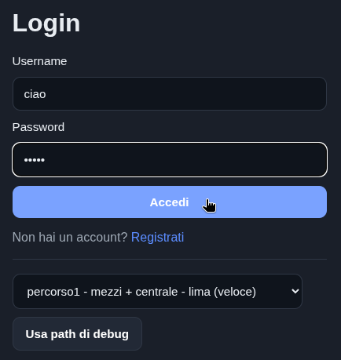

Once logged in, the user is able to select an origin and destination. This can be done either by selecting a favorite starting point and destination from the dropdown menu (pre-filled with the user's saved locations) or by typing an address in the input field. In this latter case, the platform will use Nominatim to geocode the address and will return a list of possible locations.

In the image below, the user has selected a destination from the favorites, while the origin is typed in the input field and selected from the suggestions in the dropdown menu.

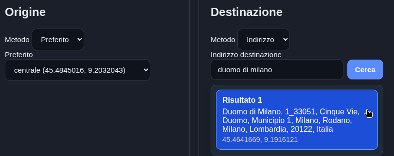

After the selection is made, the user can also choose some parameters to customize the route that will be calculated. 

The parameters are: 
- Whether the user uses a wheelchair, ensuring the route only considers accessible public transport and shows where possible obstacles are located
- Whether the user doesn't want to take public transport even if accessible
- Movement speed when walking or using a wheelchair

And this is the selector the user can tweak the parameters with:

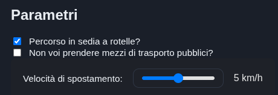

Finally, the user can send the prompt to the server that will calculate the best path for that specific request time and day.

The server response is in the form of a detailed OSM urban map with the highlighted route to take:

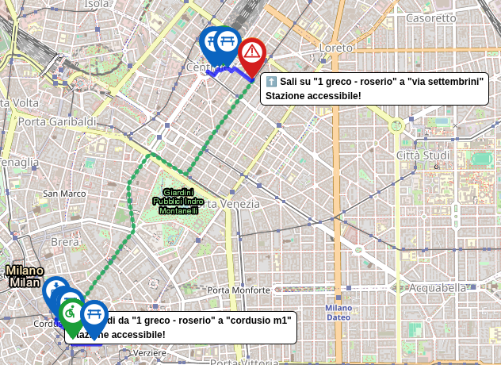

A user can then zoom in where the route has red markers to see what kind of obstacles are present along the route. In this case, there is an obstacle right next to the accessible tram station.

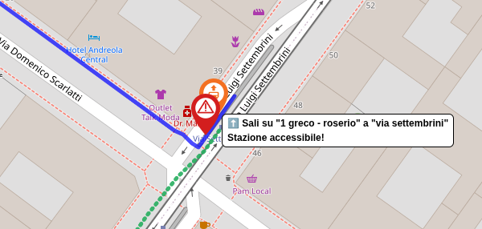

Then, to assess the severity of the obstacle or any workarounds, the user can simply click on the provided Google Street View link showing both the tram station and the obstacle to cross (high curb).

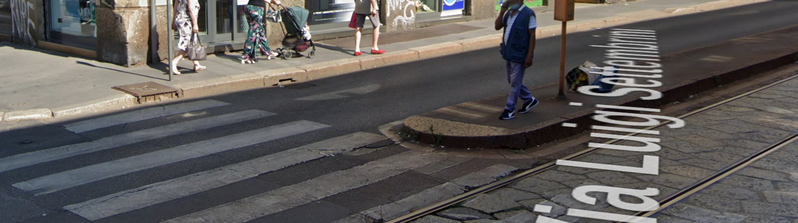

Stations that are not accessible will not be included in the proposed route, and stations that have become inaccessible in the last hour are flagged as such when displayed to the user.

Additionally, a table-based route is proposed:

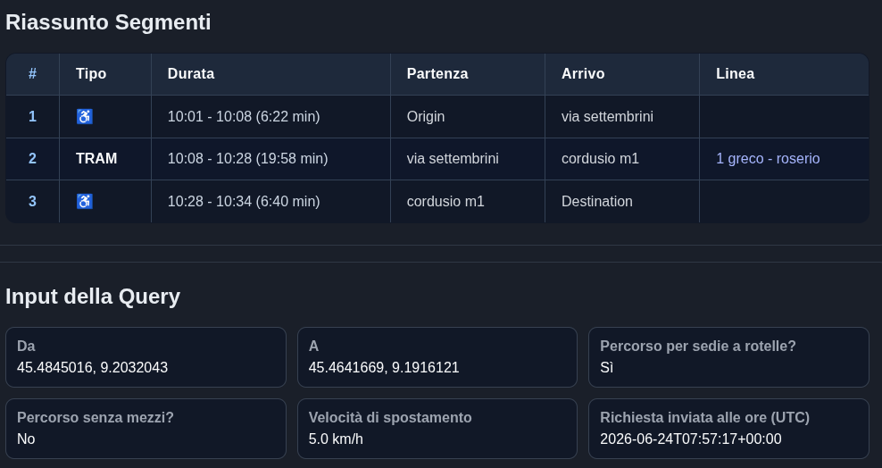

At the very bottom, all the parameters the server used to compute the route are displayed.

## Debug Routes

To better show the functionalities of OAM in a more hands-on way we've created a list of ready-made queries that can be quickly tested out even without an account.

On the login page, just below the credentials form:


For now there are a total of 6 debug routes showcasing the different functionalities:

### Route 1 and 2

These first two routes are meant to show how the movement speed slider can deeply influence the route proposed by the server. Origin and destination are the same for both queries, but for debug route 1 the movement speed is normal while for route 2 it is slowed down significantly, causing the ORS router to suggest taking an accessible metro to get to Lima as fast as possible.

Comparison of the two debug routes:

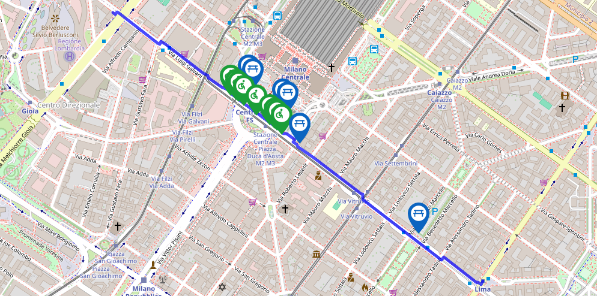
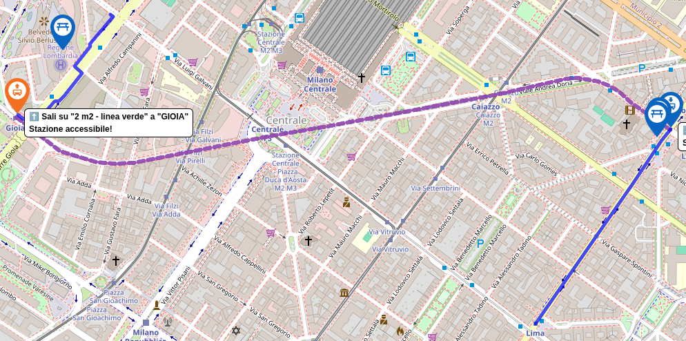

Note that both routes are allowed to take public transport into consideration, but the slider for normal movement speed made it so that just going without public transport would mean arriving sooner at the destination.

### Route 3 and 4

Route 3 and 4 are both walking-based. These intend to show the flexibility of the datasets where multiple data points, even custom-made ones, can appear in user searches.

| Route 3 with all 3 element types    |  Description of custom element type |
| ----------------------------------- | ----------------------------------- |
| 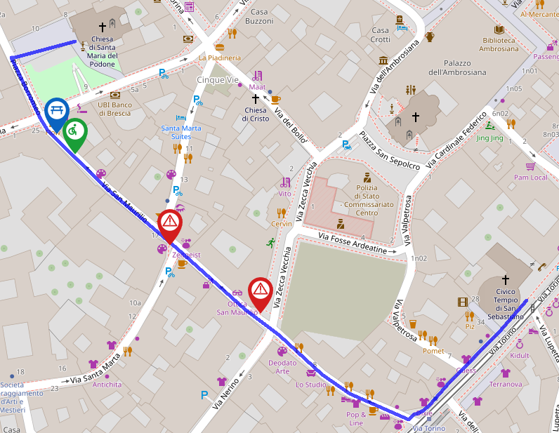 | 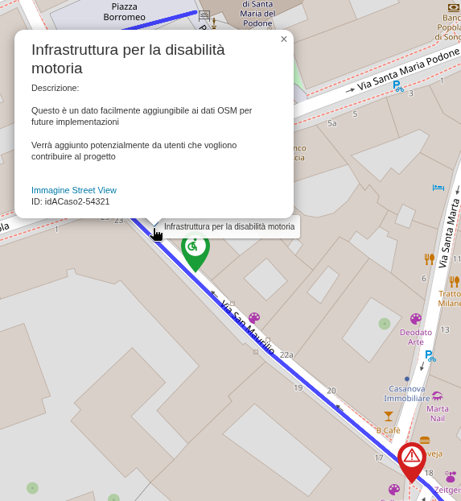 |

This was made so that a future implementation could take advantage of the community to plot barriers, facilitators, and infrastructure on the map while still relying on data points from OSM as a backbone. 

The facilitator (in green) and the infrastructure (in blue) elements in the top-left of Route 3 were not extracted from OSM but derive directly from mock users contributing to the map.

Route 4 was made to show how OAM handles routing through many obstacles. The route was chosen to be in the heart of Milan in some narrow, old streets where curbs are often raised without any slopes.

| OSM query result showing extracted barriers | Route OAM calculated |
| ----------------------------------- | ----------------------------------- |
| 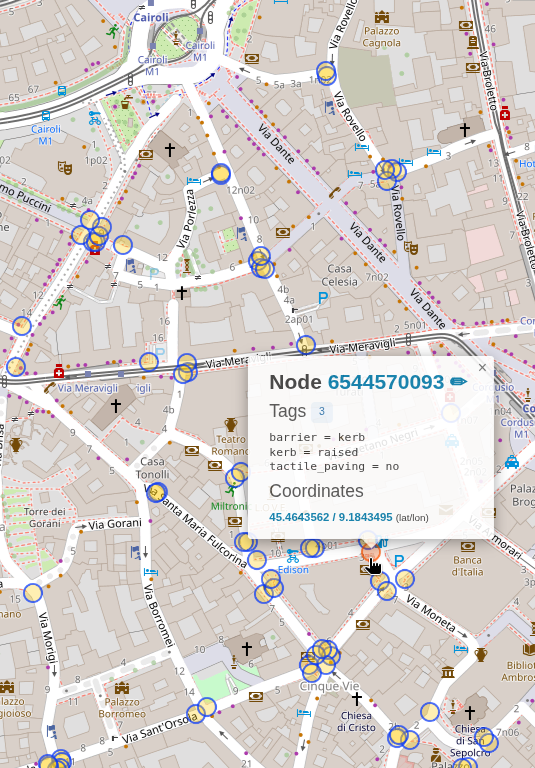 | 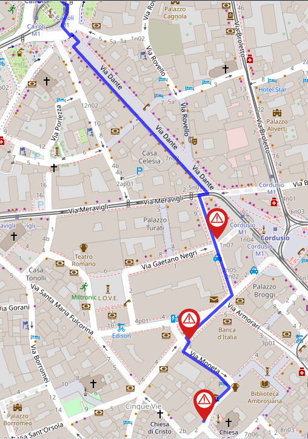 |

As displayed, the fastest path had too many obstacles, so OAM re-queried the ORS engine to reroute by avoiding the obstacles found in the first OTP routing.

### Route 5 and 6 

These final two routes are there to test out the option to take public transport into consideration. Both have the same origin and destination on two rather distant parts of Milan. 

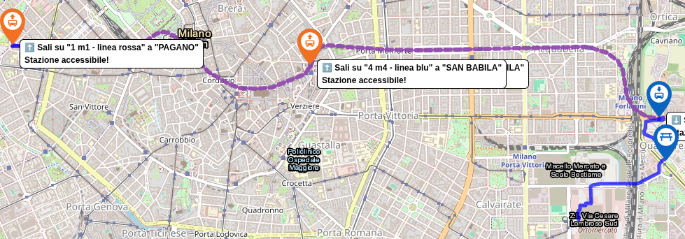
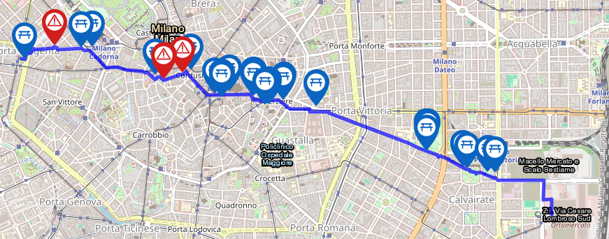

Route 5 can take public transport and it's estimated to take 53 minutes (including the 3-minute transfer time between the two metro stations), while Route 6 should take a little less than 78 minutes.

## Possibility of Expansion

As previously mentioned, users will be able to add additional points on the map (barriers, facilitators, or infrastructures of various types) to enhance everyone's experience thanks to better on-field data quality.

# Technical Stuff

## 🏗 Repository Structure

The project is structured to maintain a clean separation between application logic, raw geographic data, and generated outputs.

### 📂 `app/` (The Application Logic)
This directory contains the `Python`-based intelligence of the project.
* `main.py`: Creates the server that clients use for making requests. It uses route.py whenever it needs to calculate the best route.
* `route.py`: Computes the best route between two points using OTP and ORS acting as an orchestrator. It returns the map putput along with the segment details.
* `OTP_routing.py`: Interacts with the `OpenTripPlanner` local API to fetch multi-modal itineraries (Foot, Bus, Tram, Metro).
* `ORS_routing.py`: Interacts with the `OpenRouteService` remote API to analyze micro-accessibility (sidewalks, slopes, and foot-path details).

Other scripts include:
* `extractScraperData.py`: extracts data from github where the scraper has already done its work. This will be used by the following two documets...
* `dailyGTFSzipUpdater.py`: daily update of the GTFS file (and creation of the base line accessibility file to be compared by ...)
* `hourlyMonitor.py`: monitors the baseline with the current scraper extraction
* `maps.py`: holds many functions used to simplify map creation with folium
* `ORS_utility.py`: utility functions for ORS

### 📂 `data/` (The Data Warehouse)
This folder is mapped as a volume to the containers so they can access large datasets.
* **`OTP_data/`**: 
    * `MyMilan.osm.pbf`: The `OpenStreetMap` data for the Milan area.
    * `Milano-gtfs.zip`: The General Transit Feed Specification file containing public transport schedules.
    * `graph.obj`: The binary representation of the network. If missing, `OTP` builds it from the `.pbf` and `.zip` files.
    * `users.txt`: A configuration file where you define the start and end coordinates for your tests.
* **`ORS_data/`**: Contains supplemental `.json` extracts and datasets produced either by `extractor.py` or potential user additions.

### 📂 Configuration & Docker Files
* `docker-compose.yml`: The orchestration file that defines how the `otp-server` and `python-client` containers communicate.
* `Dockerfile`: The blueprint for the `Python` environment.
* `.env` (in gitnore): A local environment file used to securely store your `ORS_API_KEY`.
* `.env`: in gitnore since it holds personal ORS API key
* `main.sh`: bash script to run the server, takes care of everything (build + run + rebuild etc...)

## 🚀 Getting Started

Follow these steps to deploy the environment.

### 1. Prerequisites
* `Docker` and `Docker Compose` must be installed.
* An active **OpenRouteService API Key** (you can get one [here](https://account.heigit.org/)).

### 2. Initial Configuration
Create a file named `.env` in the root directory and paste your key:
```text
ORS_API_KEY=your_secret_api_key_here
```

### 3. Build and Deployment

Simply make `main.sh` executable and run it.
Otherwise, for debugging purposes, one can run the following `docker compose` command:
```bash
$ docker compose up --build
```
once the build finishes (takes several minutes and uses a fair amount of RAM) a new output file `graph.obj` will be created. 
After the build the execution of the docker immages will start automatically.
At this point there is no need to rebuild again since that is the file OTP needs for its computation. So to just execute the program again you can use:
```bash
$ docker compose up
```

#### What happens during the execution?
1. Docker builds the Python image and installs all requirements from `requirements.txt`.
2. The otp-server starts. If `graph.obj` is not present, it scans the OSM and GTFS files to "bake" the routing graph.
3. The python-client starts and waits for the OTP server to be ready to receive requests.
4. Once ready, the flask server can start receiving and fullfilling requests.

## 🛠 Useful Commands

| Action | Command |
| :--- | :--- |
| Build and Start Environment| `docker compose up --build` |
| Start Environment | `docker compose up` |
| Stop and Remove Containers | `docker compose down` |
| View Real-time Logs | `docker compose logs -f` |
| Force Rebuild of Routing Graph | `rm data/OTP_data/graph.obj && docker compose up` |
| Rebuild Python Client | `docker compose build python-app` |
